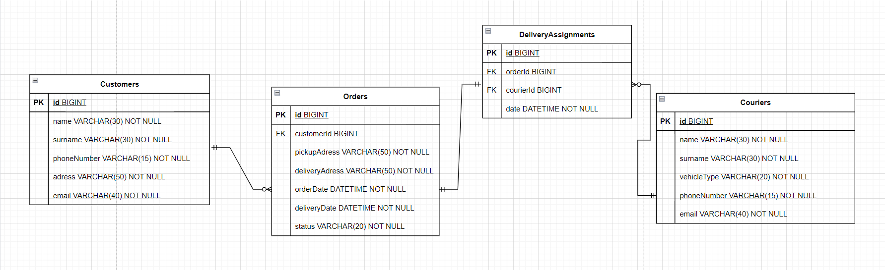

## Delivery System API

The Delivery System API is a Java-based application designed to manage the delivery process involving customers, couriers, orders and delivery assignments. It provides a RESTful interface for managing these resources, meaning it follows the principles of REST (Representational State Transfer). This ensures that the API is resource-based, uses standard HTTP methods (GET, POST, PATCH, DELETE) and supports stateless interactions.


## Features

- Manage customers, couriers, orders, and delivery assignments.
- Filter, update, and delete records.
- Handle unique constraints and relationships between entities.

## Database Schema



## Getting Started

### Prerequisites

- Java 21
- Maven
- MySQL


## Run Locally

Clone the project

```bash
  git clone https://github.com/liudziuviene/delivery-system-api.git
```

Go to the project directory

```bash
  cd delivery-system-api
```

Install dependencies

```bash
  mvn install
```

Run the application using Maven and specify the profile:

```bash
  mvn spring-boot:run -Dspring-boot.run.profiles=prod
  (You can replace `prod` with `dev` or `local`, depending on the desired configuration.)
```


## Configuration
The application uses different configuration files for different environments. These files are located in the src/main/resources directory:
- 'application-dev.properties' for development
- 'application-local.properties' for local testing
- 'application-prod.properties' for production


## Testing With Postman
To test the API endpoints, you can use Postman. Postman is a popular tool for testing RESTful APIs.
1. Download and install Postman:
- [Postman](https://www.postman.com/downloads/)
2. Create a new collection in Postman:
- Add requests to the collection for the various API endpoints.
3. Configure requests:
- Set the request method (GET, POST, PATCH, DELETE) as appropriate.
- Set the request URL (e.g., http://localhost:8080/customers).
- Add headers, body, and parameters as needed.

Example Postman requests
1. Retrieve all customers:
- Method: GET
- URL: 'http://localhost:8080/customers'
2. Add a new costumer:
- Method: POST
- URL: 'http://localhost:8080/customers'
- Body: (raw JSON)
  {
  "name": "Ana",
  "surname": "Klerk",
  "phoneNo": "1279964890",
  "address": "45 Forest avenue, Forestic city",
  "email": "ana.klerk@example.com"
  }
## API Endpoints
1. Customers
- GET /customers: Retrieve all customers.
- GET /customers/{id}: Retrieve a customer by ID.
- POST /customers: Add a new customer.
- PATCH /customers/{id}: Update a customer.
- DELETE /customers/{id}: Delete a customer by ID.
- GET /customers/filter: Filter customers by name, surname, phone number, or email.
2. Couriers
- GET /couriers: Retrieve all couriers.
- GET /couriers/{id}: Retrieve a courier by ID.
- POST /couriers: Add a new courier.
- PATCH /couriers/{id}: Update a courier.
- DELETE /couriers/{id}: Delete a courier by ID.
- GET /couriers/filter: Filter couriers by name, surname, vehicle type, phone number, or email.
3. Orders
- GET /orders: Retrieve all orders.
- GET /orders/{id}: Retrieve an order by ID.
- POST /orders: Add a new order.
- PATCH /orders/{id}: Update an order.
- DELETE /orders/{id}: Delete an order by ID.
- GET /orders/customer/{customerId}: Retrieve all orders by a customer ID.
- GET /orders/filter: Filter orders by various criteria.
4. Delivery assignments
- GET /deliveryAssignments: Retrieve all delivery assignments.
- GET /deliveryAssignments/{id}: Retrieve a delivery assignment by ID.
- POST /deliveryAssignments: Add a new delivery assignment.
- PATCH /deliveryAssignments/{id}: Update a delivery assignment.
- DELETE /deliveryAssignments/{id}: Delete a delivery assignment by ID.
- GET /deliveryAssignments/courier/{courierId}: Retrieve all delivery assignments by a courier ID.
- GET /deliveryAssignments/filter: Filter delivery assignments by courier ID, order ID, or date.
## Entities
1. Customer
- Represents a customer with properties like 'id', 'name', 'surname', 'phoneNo', 'address' and 'email'.
2. Courier
- Represents a courier with properties like 'id', 'name', 'surname', 'vehicleType', 'phoneNo', 'address' and 'email'.
3. Order
- Represents an order with properties like 'id', 'pickupAddress', 'deliveryAddress', 'orderDate', 'deliveryDate', 'status' and relationships to Customer and DeliveryAssignment.
4. Delivery Assignment
- Represents a delivery assignment with properties like 'id', 'date' and relationships to Order and Courier.
## Services
1. Customer Service
- Manages customer-related operations such as retrieving, adding, updating and deleting customers.
2. Courier Service
- Manages courier-related operations such as retrieving, adding, updating and deleting couriers.
3. Order Service
- Manages order-related operations such as retrieving, adding, updating and deleting orders.
4. Delivery Assignment Service
- Manages delivery assignment-related operations such as retrieving, adding, updating and deleting delivery assignments.

## Controllers
1. Customer Controller
- Handles HTTP requests related to customers.
2. Courier Controller
- Handles HTTP requests related to couriers.
3. Order Controller
- Handles HTTP requests related to orders.
4. Delivery Assignment Controller
- Handles HTTP requests related to delivery assignments.
## Contributing

Contributions are always welcome! Please submit a pull request or open an issue for any changes.


## License

[MIT](https://choosealicense.com/licenses/mit/)


